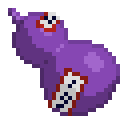

# IBUKI GOURD

[简体中文](/README.md)



[IbukiGourd](https://modrinth.com/mod/ibukigourd) is a `Minecraft Fabric MOD` primarily written in `Kotlin`. It is
designed to provide essential features for
other mods, including:

- **Config Management**
- **Config GUI**
- **Command DSL**
- **GUI DSL**


Dependencies:

- [Fabric API](https://github.com/FabricMC/fabric)
- [Fabric Language Kotlin](https://github.com/FabricMC/fabric-language-kotlin/)

## How to Use

### Dependency

Add repositories to your Gradle project:

**Gradle Groovy:**

```groovy
// Snapshot repository
maven {
    name "forpleuvoirSnapshots"
    url "https://maven.forpleuvoir.moe/snapshots"
}
// Release repository
maven {
    name "forpleuvoirReleases"
    url "https://maven.forpleuvoir.moe/releases"
}
```

**Gradle Kotlin:**

```kts
// Snapshot repository
maven {
    name = "forpleuvoirSnapshots"
    url = uri("https://maven.forpleuvoir.moe/snapshots")
}
// Release repository
maven {
    name = "forpleuvoirReleases"
    url = uri("https://maven.forpleuvoir.moe/releases")
}
```

Add the dependency:

```kts
dependencies {
    implementation("moe.forpleuvoir:ibukigourd:$version")
}
```

### Configuration

#### Client-side Configuration

For client-side configurations, the class should extend `ClientModConfigManager`.

**Example:**

```kotlin
object YourModConfigs : ClientModConfigManager(
   modMeta = yourModMeta,
   key = "key",
   autoScan = AutoScan.close
) {

   // When autoScan is disabled, manually add configuration objects to the container:
   // addConfig(configEntry)
   // Or use extension methods for configuration items

   // Using property delegation
   var stringConfig by ConfigString("config_key_1", "defaultValue")

   // When autoScan is disabled, the `string` method automatically adds the config item
   // to the container. Generally, extension methods should be defined in the respective
   // configuration class file.
   var stringByExtension by string("config_key_1", "defaultValue")

   // Without delegation
   val mapConfig = ConfigStringMap("config_key_2", mapOf("k1" to "v1", "k2" to "v2"))

   // Add a child container
   object Other : ModConfigContainer("other") {
      // Additional logic for nested settings
    }
}
```

**How to manage the configuration manually:**

```kotlin
// Initialize
YourModConfigs.init()
// Load configuration from file
YourModConfigs.load()
// Save configuration to file
YourModConfigs.save()
// Force save configuration
YourModConfigs.forceSave()
```

#### Server-side Configuration

For server-side configurations, the class should extend `ServerModConfigManager`:

```kotlin
// For initialization, pass in the Minecraft server instance.
// The rest of the operations are the same as for the client configuration.
ServerModConfigManager.init(MinecraftServer)
```

### Automatic Configuration Management

To set up automatic configuration management:

1. Add the following to `fabric.mod.json`:

    ```json
    {
      "custom": {
        "ibukigourd": {
          "package": [
            "your.code.pack"
          ]
        }
      }
    }
    ```

2. Annotate the configuration manager with `@ModConfig("config_Key")`:

    ```kotlin
    @ModConfig("config_Key")
    object YourModConfigs : ClientModConfigManager(yourModMeta, "key")
    ```

### Command DSL

Use the following method to register root commands:

```kotlin
fun <S> CommandDispatcher<S>.registerCommand(
   name: String,
   scope: ArgumentScope<S, LiteralArgumentBuilder<S>>.() -> Unit
)
```

**Example:**

```kotlin
dispatcher.registerCommand("yourCommand") {
   literal("subCommand") {
        suggests {
           // Provide suggestions
        }
        execute {
           // Execute the command
        }
    }
   argument("argName", ArgumentType) {
        execute {
           // Execution logic with command arguments
        }
    }
}
```

This example demonstrates how root commands can contain nested subcommands and arguments.

### GUI DSL

```kotlin
BoxScreen {
   Row(
      modifier = Modifier,
      verticalArrangement = Arrangement.Center,
      horizontalAlignment = Alignment.CenterHorizontally,
   ) {
      Button {
          click {
               Toast.showToast(text = "hello minecraft")
            }
         TextLabel("hello minecraft")
         Icon(IconTextures.LOCK)
      }
   }
}.open()  // Opens the screen
```


The GUI DSL facilitates intuitive layout and interaction design within Minecraft.
